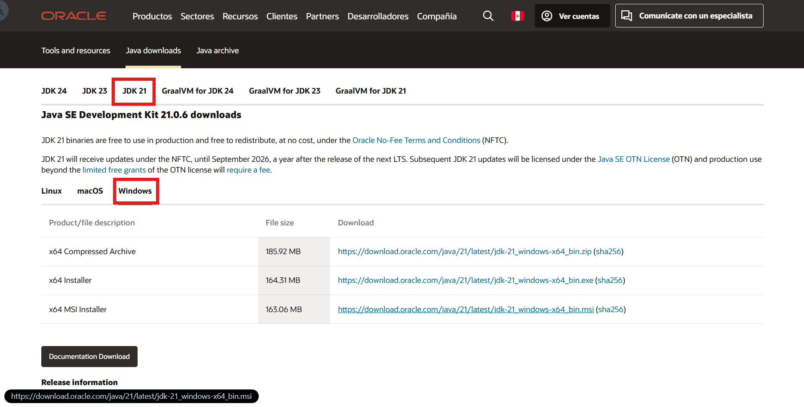
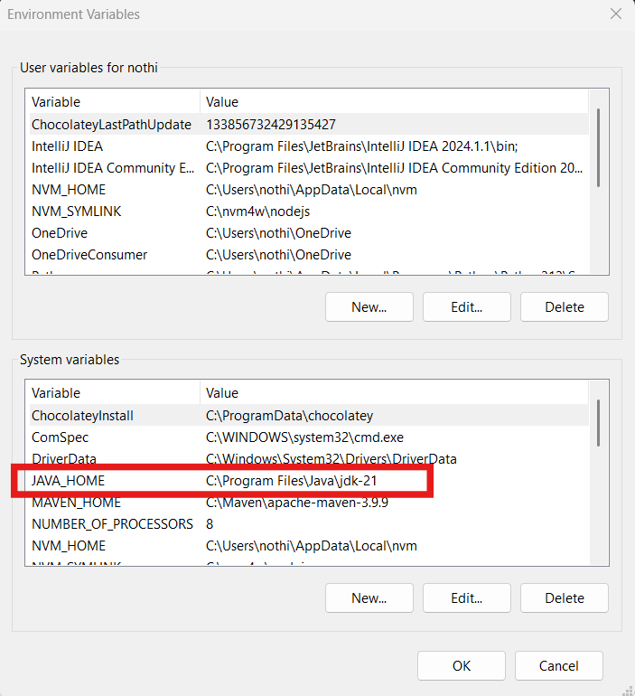
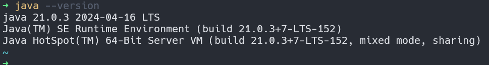
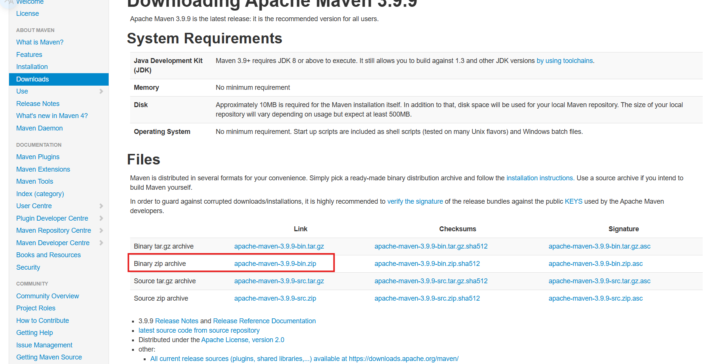
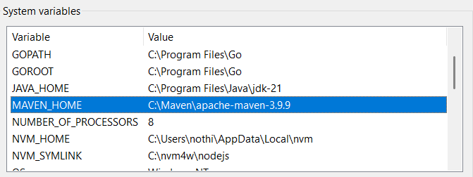
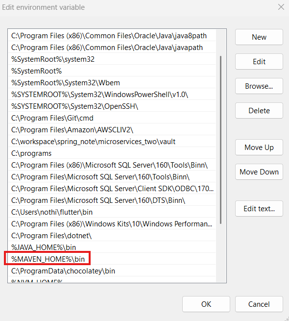

# Instalacion del entorno

### 1️⃣ Instalar Java JDK (se recomienda JDK 21)
Para desarrollar aplicaciones en Java necesitas el JDK (Java Development Kit), que proporciona herramientas para compilar, ejecutar y desarrollar software en este lenguaje.

🔗 [Descargar Java JDK](https://www.oracle.com/pe/java/technologies/downloads/)



> ⚠️ No olvides configurar correctamente las variables de entorno (JAVA_HOME y actualizar el PATH), ya que un error aquí impedirá compilar o ejecutar Java.



✔️ Verifica la instalación ejecutando el siguiente comando:
```
java -version
```



### 2️⃣ Instalar Maven (gestor de dependencias recomendado)

[Maven](https://maven.apache.org/download.cgi) es la herramienta estándar para gestionar dependencias, compilar, testear y empacar tu aplicación Java. Es ampliamente adoptado por su simplicidad y soporte.

📥 Descarga el archivo comprimido desde el sitio oficial y descomprímelo en un directorio como ``C:\Maven``. (depende de tu sistema)

Luego, configura las variables de entorno necesarias:

* MAVEN_HOME

* Añadir %MAVEN_HOME%\bin al PATH







### ➡️ [Siguiente: Crear proyecto con Spring Boot](./02-instalacion-ide.md)