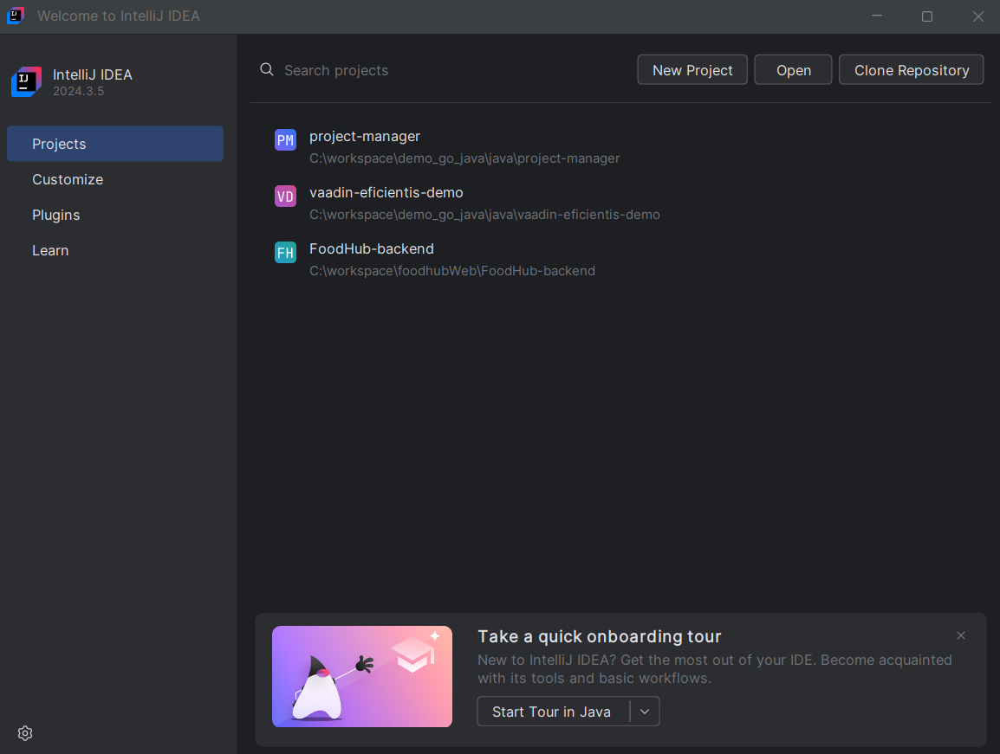

# 🧠 IDEs recomendados

Las siguientes herramientas permiten desarrollar con mayor comodidad y productividad:

- [**Visual Studio Code**](https://code.visualstudio.com/)

## 🔌 Extensiones recomendadas:

Para configurar correctamente tu entorno en [VSCode para Java](https://code.visualstudio.com/docs/languages/java), instala las siguientes extensiones desde el Marketplace:

* [Java Extension Pack](https://marketplace.visualstudio.com/items?itemName=vscjava.vscode-java-pack)

* [Spring Boot Extension Pack](https://marketplace.visualstudio.com/items?itemName=vmware.vscode-boot-dev-pack)
  
* [Lombok](https://marketplace.visualstudio.com/items?itemName=vscjava.vscode-lombok)

> Documentación necesaria: [Getting Started with Java in VS Code](https://code.visualstudio.com/docs/java/java-tutorial)

- [**IntelliJ IDEA**](https://www.jetbrains.com/idea/) (Recomendado por gran cantidad de funcionalidades avanzadas, version de paga)

| Versión           | Enlace de descarga         |
|-------------------|----------------------------|
| Ultimate (Completa)    | [Descargar](https://www.jetbrains.com/idea/download/#section=windows) |
| Community (Gratis)   | [Descargar](https://www.jetbrains.com/idea/download/#section=windows) |

  🔗  [Manual de shortcuts IntellJ IDEA](./docs/IntelliJIDEA_ReferenceCard.pdf)

### Instalación:

1. Ejecuta el instalador .exe o .msi.

2. Sigue los pasos indicados.

3. Reinicia el equipo al finalizar.

### ➡️ [Siguiente: Impotación de proyecto](./03-spring-initializr.md)