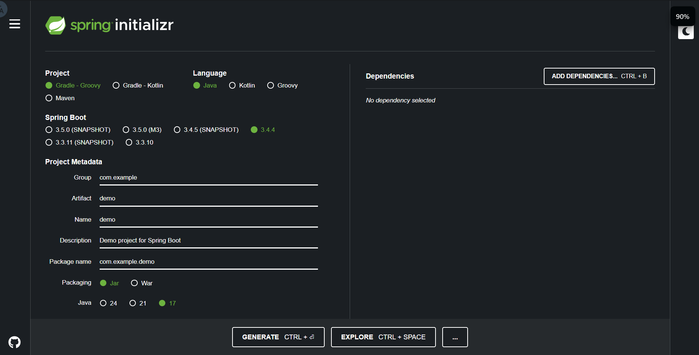
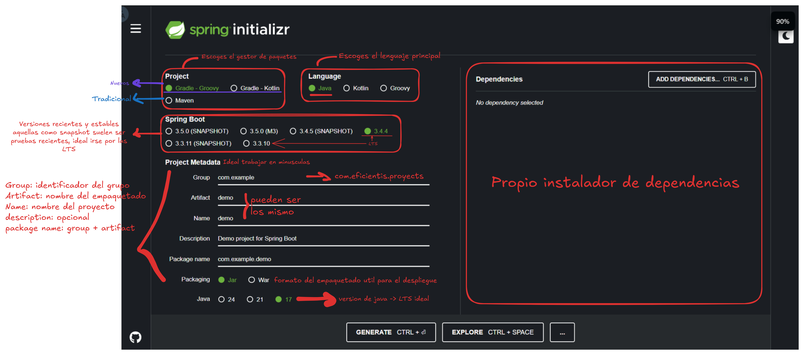
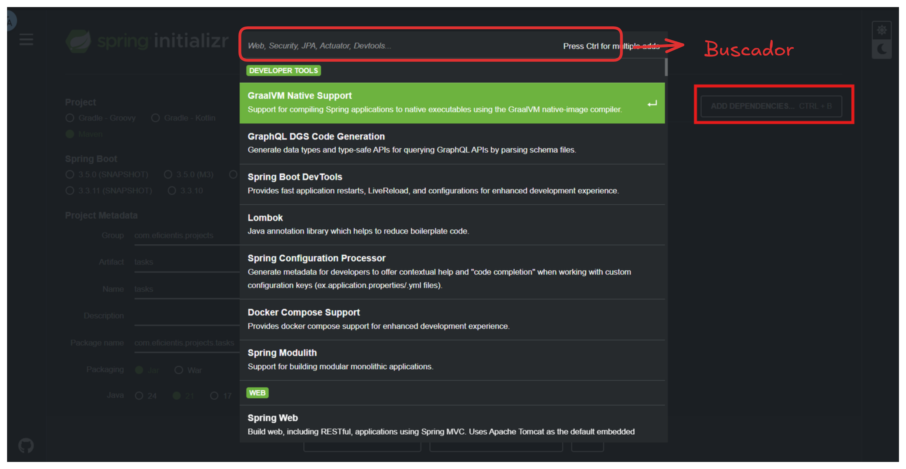
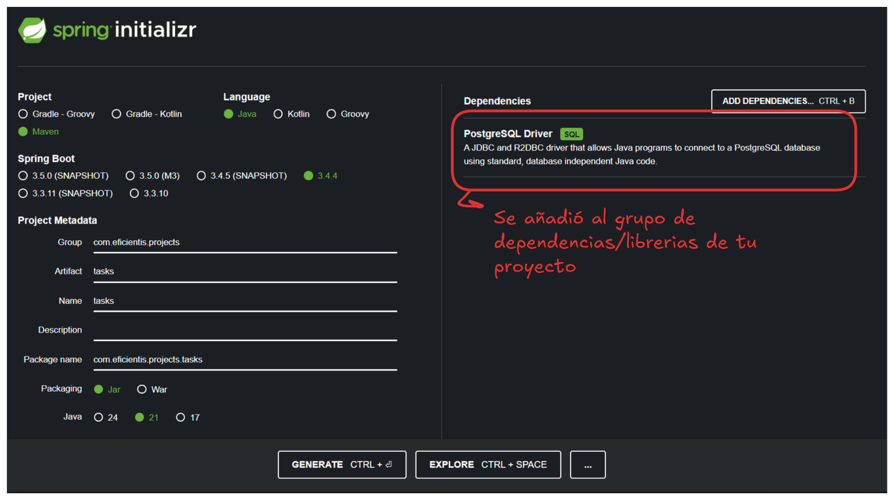
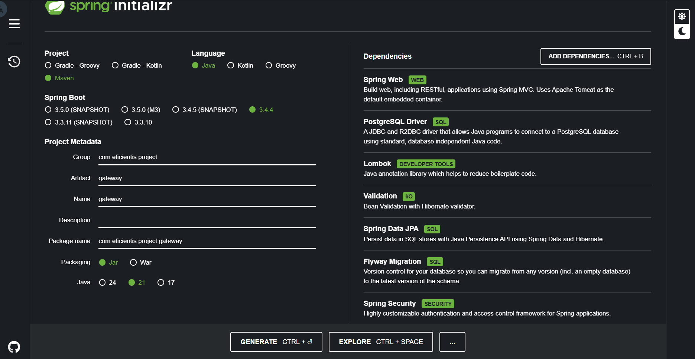
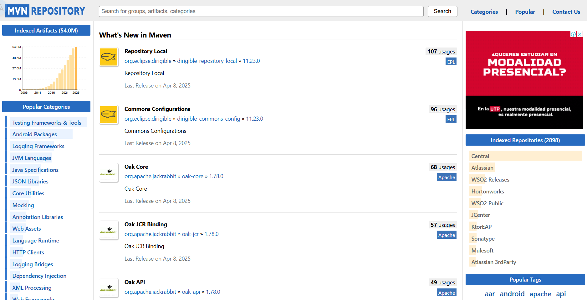
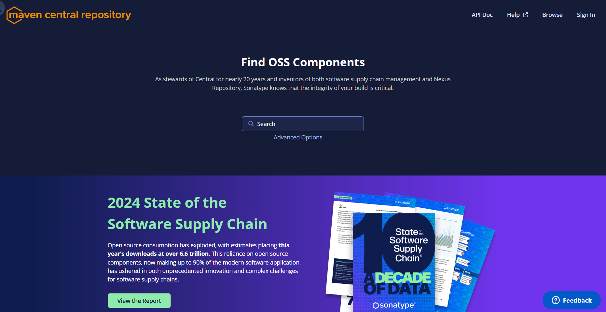

# Crear proyecto con [Spring Boot](https://spring.io/) 🚀☕
[**Spring Initializr**](https://spring.io/) es una herramienta que permite generar proyectos Spring Boot preconfigurados con solo unos clics.

---

### 🧾 Configuración inicial (metadata) recomendada

| Elemento                   | Valor                                                  |
|----------------------------|--------------------------------------------------------|
| Lenguaje                   | Java                                                   |
| Gestor de dependencias     | Maven                                                  |
| Versión de Spring Boot     | 3.4.4 (última versión estable recomendada)             |
| Group ID (paquete base)    | `com.eficientis.project`                               |
| Artifact ID                | `tenant-service`                                       |
| Nombre del repositorio     | `tenant-service`                                       |
| Descripcion                | (Opcional)                                             |
| Base package en código     | `com.eficientis.project.tenant.service`                |
| Packaging                  | `Jar`                                                  |
| Versión de Java            | 21                             |

## 📦 Convención para nombres de cada microservicio

Cada microservicio se implementará como un repositorio o módulo independiente. Se recomienda mantener una convención de nombres para el ``Artifact ID`` y el ``Group ID``.

| Microservicio	               | Nombre del repo o módulo (Artifact ID)	| Group ID sugerido            |
|------------------------------|----------------------------------------|------------------------------|
| Api Gateway         	       | api-gateway	                        | com.eficientis.api-gateway       |
| Gestión de tenants	       | tenant-service	                        | com.eficientis.tenant        |
| Gestión de usuarios	       | user-service		                    | com.eficientis.user          |
| Gestión de proyectos	       | project-service		                | com.eficientis.project       |
| Gestión de tareas	           | task-service		                    | com.eficientis.task          |
| Gestión de roles	           | role-service		                    | com.eficientis.role          |
| Sistema de notificaciones	   | notification-service	                | com.eficientis.notification  |

## 🔧 Dependencias principales

Spring Initializr permite buscar las dependencias nativas de forma sencilla.

Selecciona las siguientes dependencias desde Spring Initializr:

* Spring Web
* Lombok
* Validation
* PostgreSQL Driver
* SpringData JPA
* Spring Security + JWT ([Auth0](https://github.com/auth0/java-jwt))
* Flyway Migration

También puedes explorar más librerías y herramientas compatibles desde:

## Recursos adicionales:
- [Maven Repository](https://mvnrepository.com/)

- [Maven Central](https://central.sonatype.com/)

### ➡️ [Siguiente: Instalacion del IDE](./04-importar-proyecto.md)