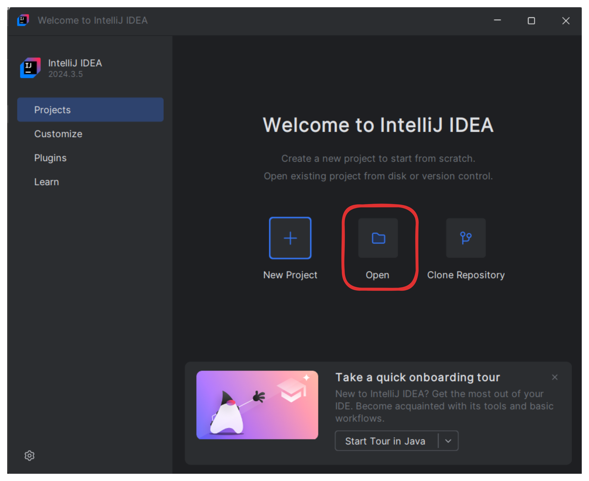
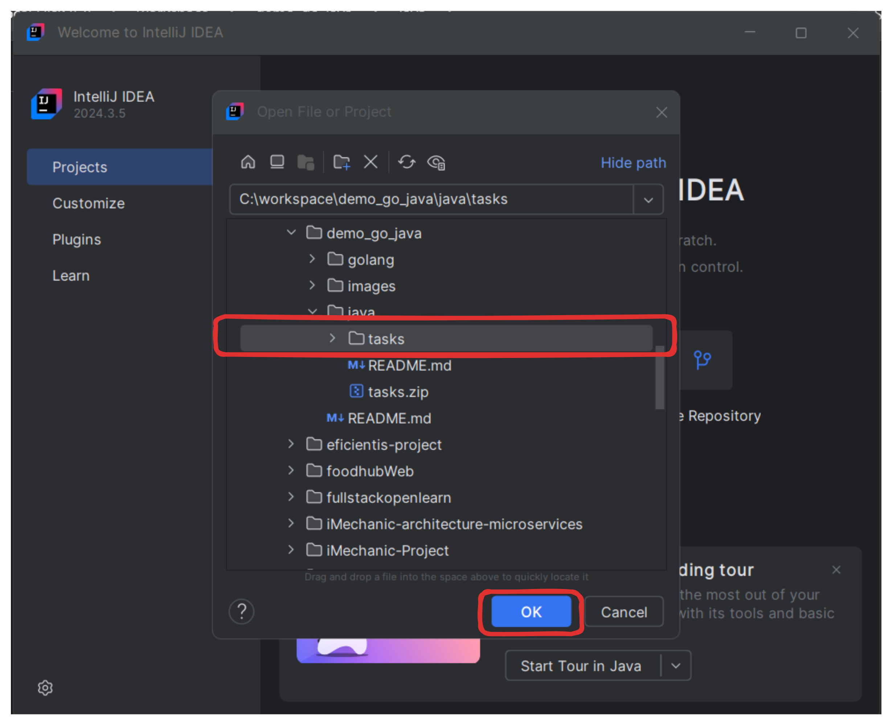
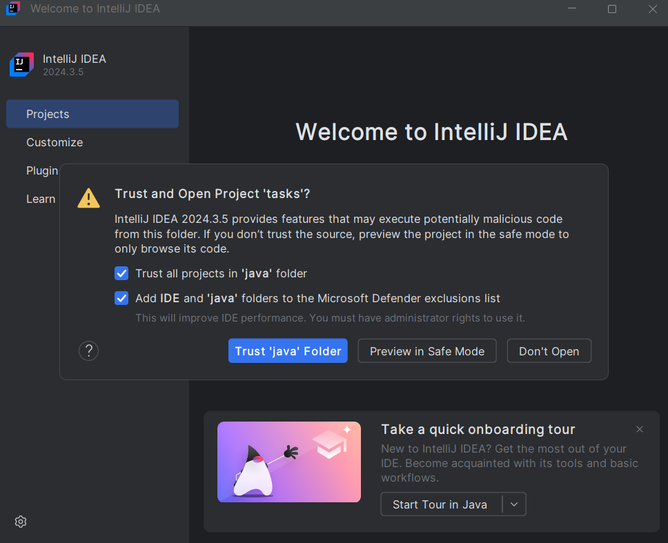

# 🧳 Importar el proyecto en IntelliJ IDEA

1. Descomprime el .rar del proyecto.

2. Abre IntelliJ IDEA.

3. Selecciona Open y navega hasta la carpeta del proyecto.

## 🚦 Configuración del arranque de la aplicación (Run Configuration)

Al abrir un proyecto por primera vez, IntelliJ puede preguntar si confías en él. Asegúrate de marcarlo como proyecto seguro y considera excluirlo del antivirus si detectas bloqueos.

### ➡️ [Siguiente: Configuración de ejecución](./05-configuracion-ejecucion.md)