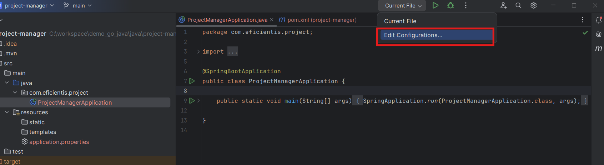
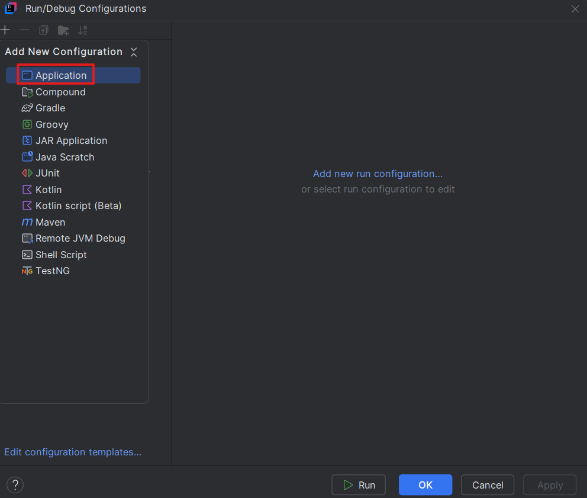
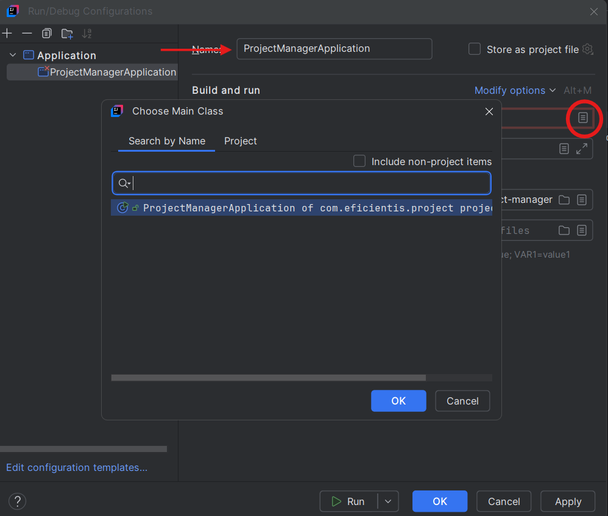
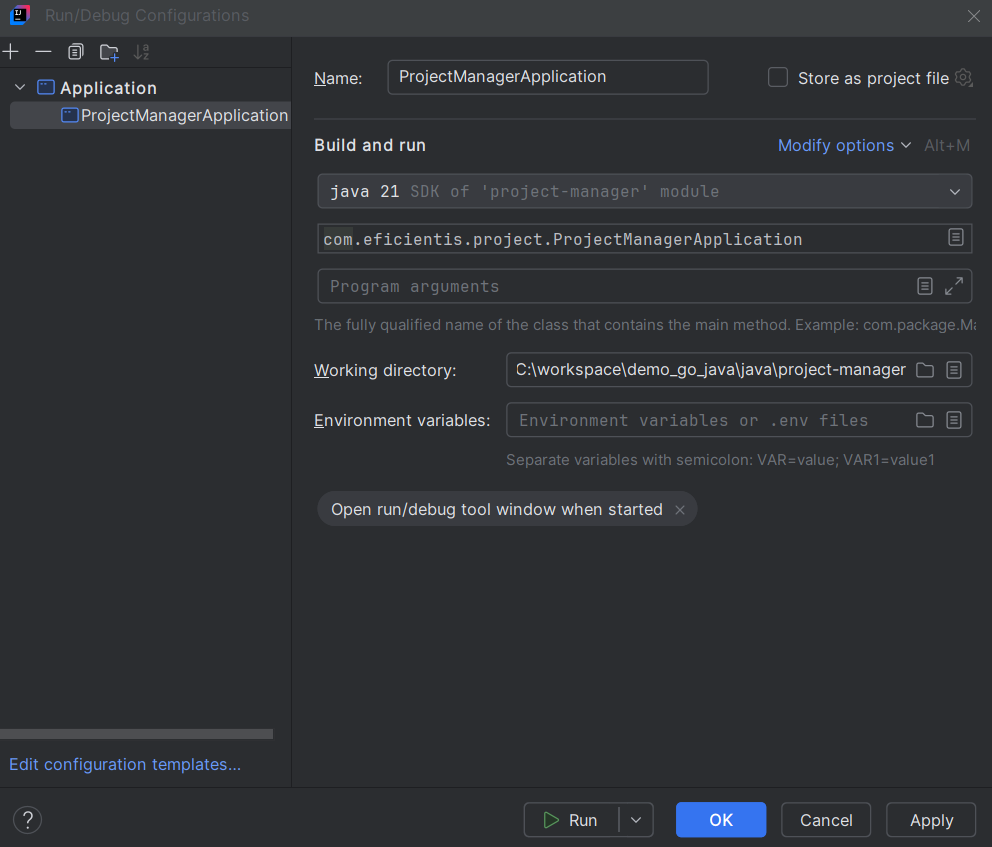
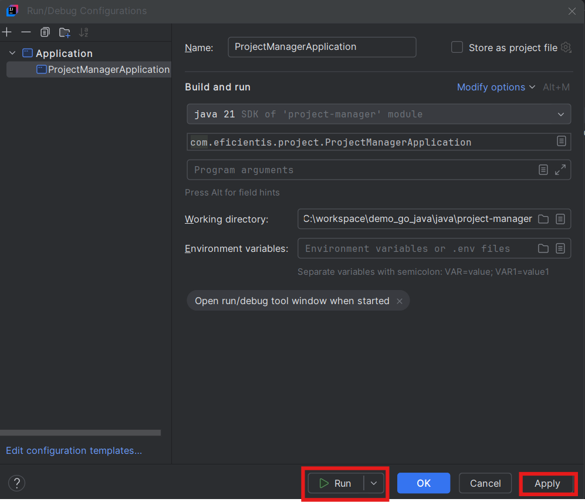
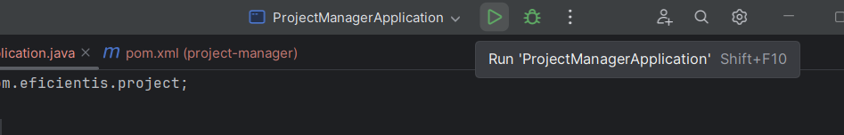

# Ejecución de la Aplicación

Hay dos formas principales de ejecutar tu proyecto:

### 1. Usando los scripts proporcionados por Spring Boot:

* En sistemas Unix/MacOS: ./mvnw spring-boot:run

* En Windows: mvnw.cmd spring-boot:run

* O directamente con Maven instalado: mvn spring-boot:run

### 2. Desde IntelliJ IDEA (recomendado):

 🔧 Para configurar la ejecución desde el IDE:

**1. Ir a la parte superior derecha de IntelliJ y hacer clic en “Add Configuration”:**



**2. Crear una nueva configuración del tipo Application:**



**3. Completar los campos con los datos del proyecto generado anteriormente (clase principal y módulo):**



**4. Verificar el módulo seleccionado:**



**5. Aplicar los cambios:**



**6. Ejecutar la aplicación:**
Una vez configurado, ya puedes correr tu aplicación desde cualquier parte del IDE.




### 📍 Accede a la aplicación desde tu navegador en:
```
http://localhost:8080
```